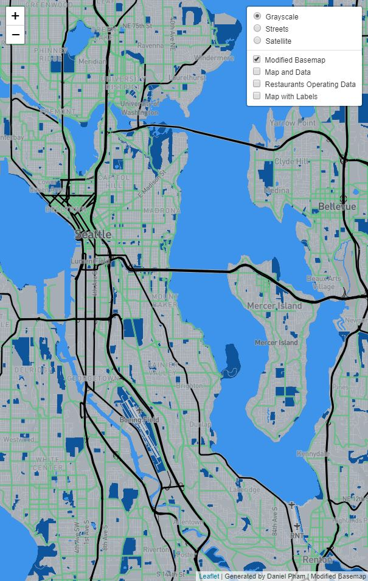
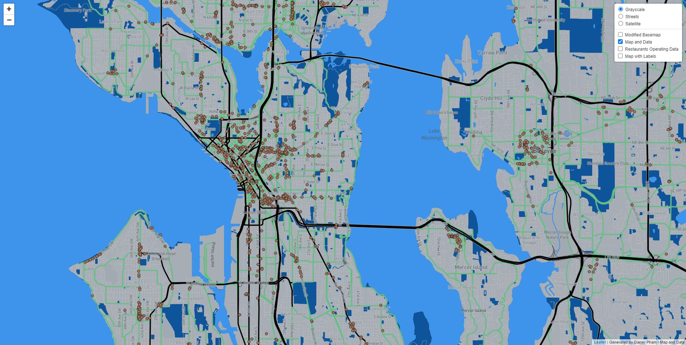
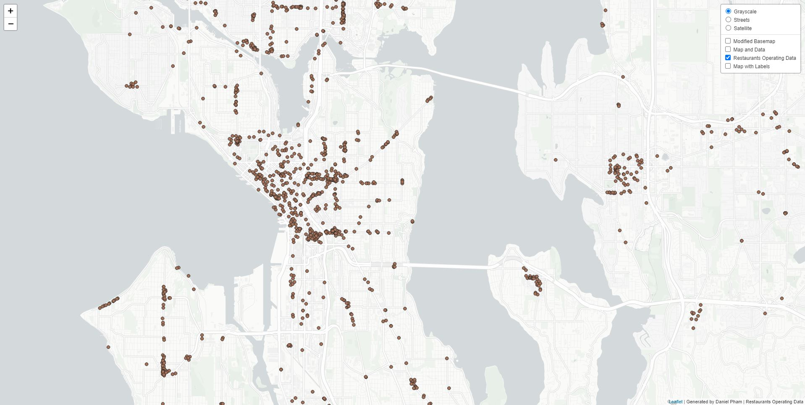
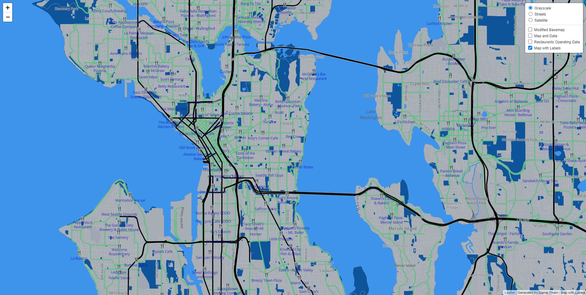

# Tile 1 - Customized Basemap

* First here is a basemap with custom generated colors focusing around the metropolitan areas of washington using colors that highlights highways and local streets.
* The geographic focus area is metropolitans around Washington state
* minZoom: 10, maxZoom: 14

# Tile 2 - Basemap with Data

* Second here is the custom basemap with data representing restaurants that are operating during COVID.
* The geographic focus area is similar to the first one mainly focusing on metroplitans areas around washington
* minZoom: 10, maxZoom: 14

# Tile 3 - Data layer

* Third here is just the data layer on its own representing resturants operating during COVID.
* The geographic focus area is similar to the first two maps mainly focusing on metroplitans areas of Washington.
* minZoom: 10, maxZoom:14

# Tile 4 - Basemap with Labels

* Lastly here is a custom basemap with labels showing the name of restaurants that are operating during COVID.
* The geographic area is still the same focusing on metroplitans areas of washington
* minZoom: 10, maxZOom: 14
